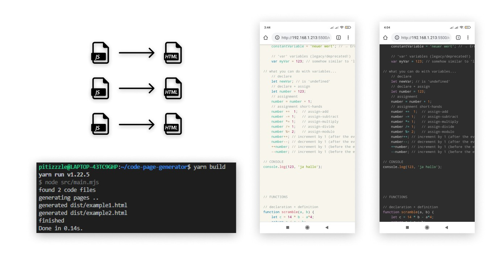

# code-page-generator
+ turn your javascript files into single-file html pages with syntax highlighting



# Usage

```bash
# download the files
git clone https://github.com/pitizzzle/code-page-generator.git

# alternative: download zip:
# https://github.com/pitizzzle/code-page-generator/archive/main.zip

# go into directory
cd code-page-generator/

# install dependencies (`prismjs`)
npm install

# config:
#  - paste your code files into the `content/` directory (or use example)
#  - choose the css stylesheet file in `config/config.mjs` (or use default)

# run the build
npm run build

# get your code pages from `dist/` folder
```
